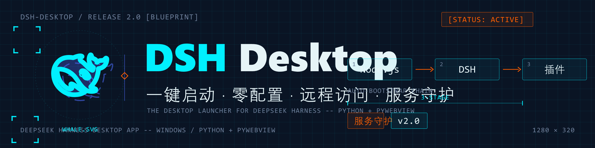

# DeepSeek Harness 桌面版（DSH Desktop）

把 [DeepSeek Harness](https://github.com/deepseek-ai/deepseek-harness) 的 Web UI 封装成**原生桌面应用**的启动器。双击即可使用，无需再手动敲命令行。

<p align="center">
  
</p>

## 🚀 v2.0 亮点

- **一键零配置启动**：按 **Node.js → DSH → 插件** 三级自动引导；全部就绪时直接进入主界面、不弹安装窗。
- **Node.js 缺失自动装**：弹双选项安装窗——`winget` 一键自动安装，或手动 MSI 后点「我已安装」自动检测，可随时切换方式。
- **自动安装两个精选插件**：`dsh-remote-gateway`（手机远程访问）与 `dsh-market`（内置插件市场，800+ 插件浏览/一键安装/主题/备份），均在 DSH 设置内可用。
- **服务守护（招牌特性）**：`dsh web` 意外退出时，8 秒宽限期后自动重新拉起并刷新窗口；插件自行重启成功时自动让出管理权，不误杀新实例。
- **隐藏控制台启动**：后端以隐藏控制台运行，agent 执行终端命令不再弹出黑窗，日志仍写入文件。
- **更稳的安装流程**：修复 allowBuilds 精确键匹配、pnpm 占位值覆盖、winget 安装后 PATH 刷新等多个"全新机器装不上"的问题。

## ✨ 功能

- **自动安装**：启动时自动检测 DeepSeek Harness（`dsh`）是否已安装，未安装则先自动执行 `npm install -g @deepseek-ai/dsh`（全局安装），安装完成后再进入主流程。
- **自动安装 Node.js**：检测到本机缺少 Node.js（含 `npm`）时弹出双选项安装窗——可一键用 `winget` 自动安装，或手动下载官方 MSI 后点击「我已安装」自动检测（含安装目录兜底探测与 PATH 注入）；安装期间可随时在两种方式间切换，且作为硬阻塞项**不可跳过**。
- **自动安装「远程访问」插件（dsh-remote-gateway）**：启动时检查 web profile 是否已安装该插件，缺失则自动安装（自动装 pnpm、处理构建许可、git 缺失时提示）；失败可「重试 / 仍然继续」。
- **自动安装「插件市场」插件（dsh-market）**：同样自动安装，之后在 DSH 设置内即可浏览、搜索并按需安装社区插件，无需再去 GitHub 手动寻找。
- 以上安装按 **Node.js → DSH → 插件** 的顺序自动引导执行；所有步骤就绪时直接开主界面，无安装窗闪烁。
- **一键启动**：自动拉起 `dsh web` 后端服务，并用 [pywebview](https://pywebview.flowrl.com/)（Windows 下基于 WebView2）以原生窗口加载 Web UI，体验接近桌面软件。
- **服务守护**：`dsh web` 意外退出（如插件一键重启失败）时，8 秒宽限期后自动重新拉起并刷新窗口；插件自行重启成功时自动让出管理权、不误杀新实例；复用外部实例时不干预。
- **隐藏控制台**：`dsh web` 以隐藏控制台启动，agent 执行终端命令不再弹出黑窗，日志仍写入文件。
- **智能复用**：若检测到 DSH 已在运行（默认 `127.0.0.1:3080`），直接复用，不重复启动。
- **自动清理**：关闭窗口后，自动结束由本程序启动的后端进程（复用已有实例时则不影响它）。
- **官方鲸鱼图标**：内置圆角鲸鱼图标（取自官方 `favicon.svg`）。
- **轻量产物**：venv 干净构建（仅必要依赖），exe 保持约 15MB。

## 📦 使用

### 方式一：直接运行 exe（推荐）

从 [Releases](../../releases) 下载 `DeepSeekHarness.exe`，双击运行即可。

> 前置条件：本机需具备 Node.js（含 `npm`）。若未安装，首次启动会弹出安装窗，可一键用 `winget` 自动安装，或手动下载 MSI 后点「我已安装」。之后会按 **Node.js → DSH → 插件** 的顺序自动安装 `@deepseek-ai/dsh`（`dsh` 命令）与远程访问、插件市场两个插件，首次启动可能耗时略长。
> 后端日志写入 `%LOCALAPPDATA%\DeepSeekHarness\dsh-web.log`。

### 方式二：Python 源码运行

需要 Python 3.10+ 与 Node.js（含 `npm`，首次运行会自动安装 `dsh` 及两个插件）：

```bash
pip install -r requirements.txt
python dsh_launcher.py
```

Windows 下也可直接双击 `run.bat` 测试，支持指定端口：`run.bat 3090`。

## 🔨 构建 exe

**方式一：双击 `build.bat`（推荐）**——一键检查 Python/依赖，若检测到桌面版正在运行会提示是否先关闭（避免 exe 被占用导致打包失败），完成后输出 `dist\DeepSeekHarness.exe`。

**方式二：PowerShell 手动打包**

```powershell
pip install -r requirements.txt
.\build.ps1
```

产物输出到 `dist\DeepSeekHarness.exe`（PyInstaller 单文件、无控制台窗口、带鲸鱼图标）。

## ⚙️ 配置

可通过环境变量覆盖后端地址：

| 变量 | 默认值 | 说明 |
| --- | --- | --- |
| `DSH_HOST` | `127.0.0.1` | DSH 后端绑定地址 |
| `DSH_PORT` | `3080` | DSH 后端端口 |

## 📁 项目结构

```
.
├── dsh_launcher.py       # 启动器主脚本
├── build.ps1             # 一键打包脚本
├── make_icon.py          # SVG 路径解析 + 鲸鱼蒙版渲染
├── make_icon_final.py    # 生成圆角图标 icon.png / icon.ico
├── favicon.svg           # 官方鲸鱼图标源文件
├── icon.png / icon.ico   # 圆角鲸鱼图标（16–256px）
└── requirements.txt      # 依赖
```

## 🖼️ 图标

图标为官方 DeepSeek Harness 的黑色鲸鱼 logo，透明底、圆角（squircle）裁剪。若需调整样式（如更换底色、颜色），修改 `make_icon_final.py` 后运行：

```bash
python make_icon_final.py
```

## 🙏 致谢

启动器默认集成了以下两个**第三方开源插件**（均不属于 DeepSeek 官方，版权归各作者所有）。感谢社区作者的分享与维护：

- **[dsh-remote-gateway](https://github.com/Yari-tuber/dsh-remote-gateway)** — 远程访问/远程控制插件，作者 [Yari-tuber](https://github.com/Yari-tuber)。基于 Cloudflare Quick Tunnel 提供带独立认证的手机浏览器远程访问，MIT 许可。实际使用需在 DSH 设置中配置用户名与密码并点击启动。
- **[dsh-market](https://github.com/dsh-market/dsh-market)** — DSH 插件市场，作者/组织 [dsh-market](https://github.com/dsh-market)。在 DSH 设置内提供插件浏览、一键安装、主题、备份等能力，MIT 许可。

> 说明：以上均为第三方开源项目，与本项目（DeepSeek Harness 桌面版）相互独立，本启动器仅在首次启动时自动安装并提供入口，不做任何额外修改。

## 📄 许可证

[MIT](LICENSE)。DeepSeek Harness 本身版权归其作者所有。
